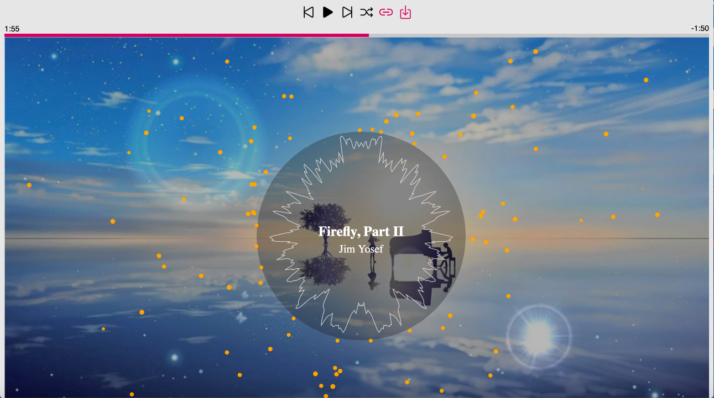

# Audio Visualizer

A music player with an audio visualizer based on Fast Fourier Transform of a waveform. The player supports the following features: 
- Rewind Song
- Play/Pause
- Seek Song
- Shuffle/Loop
- Change Background (Thumbnail of Youtube URL)
- Upload Song from File

Usage: To start the visualizer, download this repository and use an IDE to live preview `visualizer.js`.

Inspiration from Youtube channels Trap Nation and NoCopyrightSounds: 

